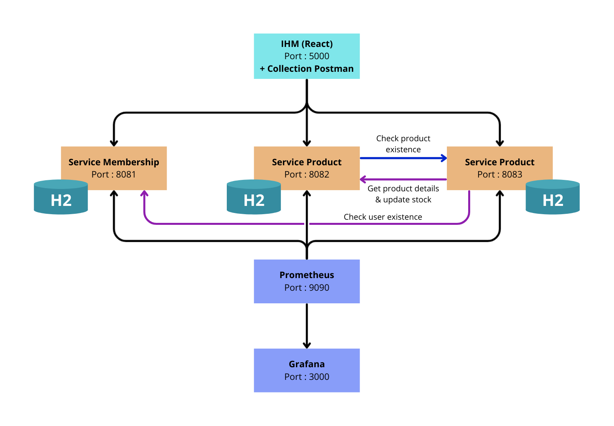

# Document d'Architecture Technique

## 1. Vue d'ensemble

Ce document décrit l'architecture de la plateforme e‑commerce composée de trois microservices principaux :

- **ms-membership** : gestion des utilisateurs (port 8081)
- **ms-product** : gestion du catalogue de produits (port 8082)
- **ms-order** : gestion des commandes (port 8083)

Chaque service suit une architecture en couches (controller → service → repository), possède sa propre base de données (H2 pour le TP, possibilité PostgreSQL en production), et expose des métriques Actuator/Micrometer pour Prometheus.

Ont été aussi rajoutés :
- **ms-front** : client web (très) léger pour intéragir avec les différents microservices (port 5000)
- **prometheus** : Vérificateur de metrics et notamment de si les services tournent (port 9090)
- **grafana** : Graphiques de quelques statistiques (incomplet)

## 2. Schéma d'architecture (diagramme)

## 3. Description de chaque microservice

#### A. MS-USER

Pratiquement aucuns changements n'ont été oppéré sur ce service.
Les seuls certains sont :
- `resources/application.yml`: ajout du nom du service dans les logs* 
- `resources/data.sql` : ajout d'objets afin de remplir la base de données
- `configuration/IdentityInitializer.java` : ajout permettant de continuer à sauvegarder de nouveaux objets en base après l'ajout de données via le script `data.sql`*
- `configuration/MetricsInitializer.java` : ajout afin de mettre à jour les metrics micrometer une fois l'application démarrée pour prendre en comptes les données créées via le script `data.sql`

\* ajouts faits sur tous les services

#### B. MS-PRODUCT

Responsabilité : gestion CRUD du catalogue produit.

Points clés :
- Entité `Product` avec validation (nom, description, price > 0, stock >= 0, category enum).
- Endpoints REST listés dans le cahier des charges (search, category filter, available, patch stock).
- Health check personnalisé `LowStockHealthIndicator` (DOWN si trop peu de produits en stock).
- Métriques : compteur `products.created.count` par catégorie, métriques de stock.

Contraintes business :
- Interdire la suppression d'un produit s'il existe dans une commande (vérification via `ms-order` ou flag soft-delete).
- Stock non négatif ; prix à 2 décimales.

#### C. MS-ORDER

Responsabilité : gestion des commandes et items associés.

Points clés :
- Entités `Order` et `OrderItem` avec calcul automatique des sous-totaux et `totalAmount`.
- Vérification à la création : existence de l'utilisateur (`ms-membership`) et disponibilité des produits (`ms-product`).
- À la création, déduction du stock sur `ms-product` (appel REST synchrones) — gérer transactions compensatoires en cas d'échec.
- Métriques : compteur `orders.count` par statut, gauge `orders.totalToday`.

Business rules :
- Une commande `DELIVERED` ou `CANCELLED` est immuable.
- Une commande doit contenir au moins un `OrderItem`.

## 4. Choix technologiques justifiés

- Langage : Java + Spring Boot — Pour garder la stack de ms-membership, + pratique et très adapté
- Build : Maven — gestion standard des dépendances, facilitation pour le packaging
- DB pour le TP : H2 (en mémoire) — DB très légère et adaptée à la spontanéité du projet. Configuration possible pour stocker via un fichier mais pas nécessaire via les scripts sql
- Observabilité : Spring Boot Actuator + Micrometer (Prometheus) + Grafana - Package tout-en-un permettant de facilement remonter des données clés
- Communication inter-services : WebClient (synchronous REST) — amplement suffisant pour le TP et très facilement intégrable via Maven + Spring

## 5. Stratégie de communication inter-services

- Appels REST synchrones avec timeouts
- Pour chaque appel critique (vérifier user / product), gérer erreur et propager un message utilisateur clair.
- Pour opérations qui modifient plusieurs services (création de commande => décrément de stock), adopter une stratégie simple :
	- vérifier en amount chaque objet avec de tenter les mises à jour en séquence ; en cas d'échec, renvoyer erreur 5xx.
    - Possibilité d'erreur si jamais commande effectuée en parallèle qui vide pile le stock, mais peu probable

## 6. Gestion des données (base de données par service)

- Isolation des données par service (pas de base partagée).
- Scripts `data.sql` pour initialisation (5-10 objets comme demandés, variété dans les objets).
- Transactions locales gérées via Spring Data / @Transactional.

## 7. Gestion des erreurs et résilience

- Timeout et circuit-breaker (optionnel) pour isoler services défaillants.
- Contrôles de validation en entrée (Bean Validation) et gestion centralisée via `@ControllerAdvice`.
- Health checks personnalisés :
	- `ms-product` expose `LowStockHealthIndicator`.
	- `ms-order` vérifie la disponibilité des services `ms-user` et `ms-product`.
